# Klima 2.0
The Dark Sole Enterprise Ltd <ds@darksole.vip>  
with contributions from the Klima and Carbonmark teams

6 Feb 2026 (Version 1.49)

**Copyright Notice**

This document represents original work by dark_sole <ds@darksole.vip>.
While contributions from others are gratefully acknowledged, all
intellectual property rights remain with the author. The models,
algorithms, processes, products, methodologies, and concepts described
herein are licenced exclusively for commercial use by the Klima
Protocol. No other party may implement, copy, modify, or derive works
from these materials without explicit written permission from the
author.

© 2025 dark_sole. All rights reserved.

## Prologue

Klima 2.0 is an autonomous, rules-based coordination protocol designed
to support the retirement of carbon credits through continuous and
transparent execution terms.

It is not a financial product, investment vehicle, or asset management
system, but a piece of market infrastructure that enables carbon supply
and retirement demand to interact under predefined conditions. While the
protocol issues additional tokens to certain participants, these
emissions are purely rule-based incentives for coordination and
infrastructure provision, not a guarantee of financial return or claim
on underlying assets.

The protocol operates through a dual-token architecture that facilitates
coordination without discretionary control: **kVCM** functions as the
internal unit of account and pricing reference for protocol-facilitated
carbon, while **K2** provides signalling inputs related to capacity.
Together, these tokens inform protocol parameters through deterministic
smart-contract logic. This architecture enables the protocol to:

- define execution terms and intake eligibility for carbon credits
  against transparent, predefined rules;

- make acquired credits available exclusively for irreversible
  retirement;

- coordinate liquidity provision and participation incentives required
  for continuous operation.

Participant actions such as locking tokens, signalling preferences, or
providing liquidity serves as inputs into a coordination mechanism that
adjusts protocol parameters within predefined bounds. These inputs do
not confer ownership rights, redemption rights, or claims on
protocol-held carbon, nor do they constitute discretionary management of
assets.

The protocol consists of three interdependent functional layers:

- a carbon inventory layer that holds credits solely for the purpose of
  facilitating retirement;

- a liquidity layer that supports access and withdrawal from the system
  through external markets; and

- a coordination layer that aggregates participant signals to inform
  protocol parameters.

These layers are designed to operate together as a self-contained
system, adjusting to observable supply and retirement demand without
reliance on external oracles, manual intervention, or fee-extractive
intermediaries.

Klima 2.0 abstracts complex carbon market interactions into a
transparent and auditable execution framework, enabling participants to
interact with carbon retirement infrastructure directly,
programmatically, and on equal terms.

Any economic effects arising from protocol activity result from
predefined rules and market interaction, rather than from asset
ownership, portfolio management, or profit extraction.

## Klima 2.0

KlimaDAO launched in 2021 on the Polygon blockchain as an early
experiment in applying tokenisation and onchain liquidity to voluntary
carbon markets. The initial design centred on the KLIMA token and a
treasury-based mechanism intended to bootstrap liquidity and
participation in a nascent onchain carbon ecosystem.

That first iteration played a meaningful role in demonstrating that
carbon credits could be represented, transferred, and retired using
blockchain infrastructure. It also catalysed the development of a
broader ecosystem of tools and services, including integrations with
multiple carbon registries, marketplaces and point-of-sale interfaces,
APIs for third-party applications, and direct onchain issuance by
project developers.

Over time, it became clear that the original architecture was not well
suited to serving large-scale, enterprise carbon buyers or to supporting
continuous, rules-based market operation without manual intervention. In
particular, treasury-centric designs introduced complexity, opacity, and
governance challenges that limited scalability and operational clarity.

Klima 2.0 is a ground-up redesign informed by these lessons. Rather than
relying on treasury management or discretionary allocation, the new
protocol is structured as neutral, non-extractive market infrastructure
focused exclusively on facilitating carbon retirement through
transparency, programmatic settlement, and open participation.

The Klima 2.0 protocol replaces treasury-backed mechanisms with a
rules-based coordination model that uses protocol-native tokens to
parameterise execution terms, intake capacity, and participation
incentives. Carbon credits handled by the protocol are acquired solely
to fulfil retirement demand and are not held, traded, or managed for
financial gain.

This shift reflects a deliberate move away from capital-centric designs
toward infrastructure that prioritises auditability, predictability, and
long-term operational resilience. Klima 2.0 is intended to function as a
shared execution layer for carbon markets, enabling suppliers, buyers,
and integrators to interact under predefined conditions without reliance
on discretionary intermediaries.

### High-Level Architecture

Klima 2.0 operates using two protocol-native tokens, **kVCM** and
**K2**, which together enable rules-based coordination and participation
within the system. These tokens do not confer ownership rights,
redemption rights, or claims on protocol-handled carbon, and do not
represent investment interests.

The **kVCM** and **K2** tokens are used in three interdependent
functional layers that together support continuous, non-discretionary
operation:

1.  **Carbon Inventory Layer**:

    - Accumulates carbon credits by minting **kVCM**.

    - Sells carbon retirement certificates by burning **kVCM**.

    - Sets carbon execution terms based on predefined rules.

    Carbon credits handled by the protocol cannot be withdrawn,
    transferred, or resold. They may only be retired.

2.  **Liquidity Layer**:

    - **kVCM** and **K2** token holders are able to pair their tokens
      together (or, in the case of **kVCM**, with USDC) in a standard
      liquidity pool to provide liquidity and generate fees on trades
      executed through the pool.

    - Liquidity providers may stake their liquidity provider tokens for
      a fixed time period of their choice, making them eligible to
      receive a share of the **kVCM** and **K2** incentives.

3.  **Coordination Layer**:

    - **kVCM** holders may **time-lock** their **kVCM** for a fixed time
      period of their choice, making them eligible to receive **kVCM**
      base accrual, **K2** incentives, and to allocate their **kVCM** to
      carbon classes – which increases the comparative weighting of
      these carbon classes in the inventory.

    - **K2** holders may **user-lock** their **K2** for at least 48
      hours, making them eligible to receive **kVCM** and **K2**
      incentives, and to allocate their **K2** to carbon classes – which
      reduces the difference between the execution terms on carbon
      intake and retirements for these carbon classes.

    - Time-locked **kVCM** holders participate in protocol coordination
      alongside liquidity providers with liquidity staked in the
      **kVCM**/**K2** liquidity pool.

These layers operate together as a self-contained system that responds
only to its own observable state, without reliance on external oracles
or centralised intervention.

### Carbon Inventory

The protocol’s carbon inventory accumulates and retires carbon. It is
driven by parameters determined by its rules-based smart contracts, and
user activities.

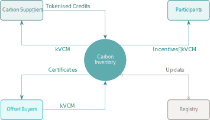

Figure 1: Klima 2.0 Carbon Inventory.

Carbon credits are acquired from suppliers, and consumed by retirement
buyers. Carbon credits are grouped by predefined classifications called
**carbon classes**.

Aggregate token holder allocations collectively set the parameters for
the execution terms of **each class**, for both suppliers and retirees,
by defining:

- Inventory weighting.

- Capacity.

Thus the protocol is driven by its own native token allocations, acting
as rules-based carbon market infrastructure to connect available supply
with retirement demand.

### Tokens

Locking or staking the protocol’s tokens allows participants to signal
preferences within the system, and may make them eligible to receive
protocol incentives.

Together, **kVCM** and **K2** enable the protocol to operate as neutral,
non-extractive infrastructure, coordinating participation and execution
without discretionary management.

#### kVCM

**kVCM** is the protocol’s primary utility token. Its supply is <u>not
capped</u>: it grows when new carbon is supplied to the protocol and via
rule-based emissions (base accrual and incentives), and it contracts
when carbon is retired.

- When **time-locked**:

  - It may be allocated to carbon classes for inventory weighting.

  - It receives **kVCM** base accrual and **K2** incentives.

  - In aggregate, time-locks determine the rate of incentive issuance.

- **Transactional** usage:

  - **Mint**: when suppliers deliver carbon to the protocol.

  - **Burn**: when credits are retired from the protocol.

- When **staked** in liquidity pools it is also eligible for **kVCM**
  and **K2** incentives, based on the duration of the stake and the
  position’s relative share of the pool.

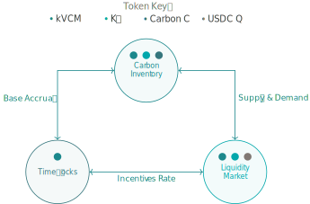

Figure 2: Token utility.

#### K2

**K2** is a <u>fixed-supply</u> token distributed programmatically over
time.

- When **user-locked**:

  - It may be allocated to carbon classes to reduce the difference
    between execution terms on carbon intake and retirements.

  - It receives **kVCM** and **K2** incentives.

  - In aggregate, user-locks influence the rates of incentive issuance.

- When **staked** in the **kVCM**/**K2** liquidity pool it is also
  eligible for **kVCM** and **K2** incentives, based on the duration of
  the stake and the position’s relative share of the pool.

#### Utility Functions

The **kVCM** token has <u>two</u> utility functions which are not
independent:

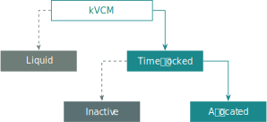

Figure 3: **kVCM** utility functions.

1.  **Time lock**: The **kVCM** token is locked for a specific period of
    time which determines a **kVCM** ‘base accrual’ rate. This time
    period cannot be amended.

2.  **Execution terms allocation**: Collective signalling of carbon
    classes via **kVCM** allocations determines the protocol’s execution
    terms for carbon intake and retirement, expressed in **kVCM** units.
    These parameters govern how the protocol issues or burns **kVCM**
    when carbon is supplied or retired. Allocations may be updated over
    time.

The **K2** token also has <u>two</u> utility functions:

1.  **User lock**: The **K2** token remains locked for at least 48
    hours.

2.  **Capacity allocation**: Collective selection of carbon classes via
    **K2** allocations determines the protocol’s execution capacity for
    carbon intake and retirement operations for a given class. Higher
    capacity allocations increase the system’s ability to process
    additional carbon activity without materially altering the execution
    terms, as defined by **kVCM** allocations.

Both tokens support the operation of the infrastructure, with **kVCM**
informing execution terms, and the **K2** token modulating capacity.

#### Base Accrual and Incentives

The protocol issues tokens to participants who provide services
necessary for system operation.

1.  **kVCM Base Accrual**

    A base accrual of **kVCM** tokens is continuously emitted to:

    - Time-locked **kVCM** positions.

2.  **kVCM Incentives**

    **kVCM** incentives are continuously emitted to:

    - User-locked **K2** poositions.

    - Both **kVCM** and **K2** liquidity providers.

    The number of **kVCM** tokens emitted as **kVCM** incentives is
    proportional to (but never higher than) the number of **kVCM**
    tokens emitted as base accrual.

3.  **K2 Incentives**

    Depending on overall system balances, the supply of **K2** tokens is
    programmatically allocated at various rates to:

    - Time-locked **kVCM** positions.

    - User-locked **K2** positions.

    - Both **kVCM** and **K2** liquidity providers.

#### Token Initialisation

There is an initial issuance of tokens at the genesis of Klima 2.0. All
future emissions are distributed autonomously via carbon swaps and
incentives.

<table class="column-body-outset">
<colgroup>
<col style="width: 10%" />
<col style="width: 15%" />
<col style="width: 75%" />
</colgroup>
<thead>
<tr>
<th style="text-align: left;">Token</th>
<th style="text-align: left;">Supply</th>
<th style="text-align: left;">Notes</th>
</tr>
</thead>
<tbody>
<tr>
<td style="text-align: left;"><strong>kVCM</strong></td>
<td style="text-align: left;">20 million</td>
<td style="text-align: left;"><ul>
<li>Supply expands and contracts programmatically in response to carbon
intake and retirement activity.</li>
<li>New tokens are emitted continuously as base accrual and
incentives.</li>
<li>A portion of the initial supply is allocated to existing KLIMA
holders.</li>
</ul></td>
</tr>
<tr>
<td style="text-align: left;"><strong>K2</strong></td>
<td style="text-align: left;">100 million</td>
<td style="text-align: left;"><ul>
<li>Fixed supply.</li>
<li>Distributed programmatically over time, with a portion allocated to
existing KLIMA holders.</li>
</ul></td>
</tr>
</tbody>
</table>

Table 1: Token Summary

### Participants

1.  **Carbon Suppliers & Retirees**

    Participants may supply or retire eligible, tokenised carbon credits
    to the protocol at quoted execution terms. Supplied credits are
    handled solely for retirement and cannot be withdrawn, transferred,
    resold or otherwise arbitraged.

    **Carbon inventory**: Indicative execution terms for suppliers and
    retirees are continuously updated based on protocol state.

2.  **Liquidity Providers**

    Participants may provide liquidity in supported token pairs to
    facilitate entry and exit from the system. Liquidity provision
    supports continuous execution and is incentivised according to
    predefined protocol rules.

    **Staked liquidity**: Protocol incentives may be issued for
    participants providing liquidity to support system operation.

3.  **Coordinators**

    Participants may influence execution conditions by allocating
    **kVCM** and **K2** tokens within predefined protocol parameters.

    **Time locks & user locks**: Protocol incentives may be issued for
    those contributing activities that coordinate the protocol and
    signal long-term participation.

### Protocol Design Principles

1.  **Infrastructure, Not Extraction**:

    Klima 2.0 is designed as shared market infrastructure rather than an
    extractive financial product. The protocol does not charge fees,
    take hidden spreads, or operate profit-taking mechanisms for any
    sponsor, foundation, or investor. Standard trading fees charged by
    external automated market makers and venues are separate from, and
    not controlled by, the protocol.

    **Design intent**: Reduce opaque intermediation and hidden margins
    common in carbon markets, not replace them with a new rent-seeking
    intermediary.

2.  **Consumption-only Carbon Access**:

    Carbon credits handled by the protocol are not exposed for resale,
    speculation, or secondary trading. Once accepted by the protocol,
    credits may only be accessed for irreversible retirement through
    protocol-defined processes.

    **Design intent**: Align the system with carbon’s end use
    (retirement), rather than treating credits as financial instruments.

3.  **Coordination Through Signalling**:

    Protocol tokens do not represent ownership of carbon, claims on
    protocol-held assets, or entitlement to surplus value. Instead,
    tokens function as signalling and coordination inputs that influence
    protocol parameters (such as execution conditions and capacity)
    within predefined bounds.

    **Design intent**: Enable decentralised coordination in a complex
    and competitive environment.

4.  **Autonomous, Rules-based Operation**

    All core economic behaviour is governed by deterministic smart
    contracts. Once deployed, the systems day-to-day operations are
    autonomous and do not rely on discretionary decisions by any
    individual, committee, or organisation. Any material upgrades or
    migrations of the protocol implementation will be publicly disclosed
    and applied uniformly to all participants.

    **Design intent**: Build a trustless, auditable system, that is not
    based on subjective, opaque intervention.

5.  **Equal Access and Uniform Treatment**

    All on-chain interactions with the protocol (carbon intake,
    retirement, locking, liquidity, incentives) occur on identical terms
    for all users. While initial token allocations differ by cohort (see
    <a href="#sec-klima-2.0-token-distribution"
    class="quarto-xref">Section 4</a>), no cohort receives preferential
    execution, pricing, or fee treatment within the protocol.

    **Design intent**: Ensure credibility, neutrality, and resistance to
    capture.

6.  **Market-driven Outcomes, Not Managed Returns**

    Any economic effects associated with protocol participation arise
    solely from predefined rules and participant interaction with the
    system. The protocol does not manage assets on behalf of users,
    target returns, or seek to optimise outcomes for any class of
    participant.

    **Design intent**: Enable transparent market coordination without
    positioning the protocol as an asset manager or investment vehicle.

## Core Protocol Mechanics

From this section we refer to **kVCM** tokens as **A**, **K2** tokens as
**G**, USDC tokens as **Q**, carbon credits as **C**, and carbon
retirement certificates as **C\***.

Three types of mechanics enable the Klima Protocol to find equilibrium
through continuous, rule-based feedback mechanisms representing system
state (supply, demand, coordinator allocations).

1.  **Time-locking mechanics**: **A** token holders can time-lock their
    tokens until a set date to have the ability to select carbon classes
    for inventory weighting.

    - The collective time locks define the base accrual curve.

2.  **Carbon inventory mechanics**: the protocol swaps **A** for carbon
    credits **C** (in) or carbon retirement certificates **C\*** (out).

    - Both allocations of time-locked **A** tokens and user-locked **G**
      tokens are used in the protocol: allocations of **A** determine
      the execution terms of carbon, and allocations of **G** determine
      capacity.

3.  **Liquidity mechanics**: External liquidity pools enable conversion
    between **kVCM** and supported settlement assets. Liquidity
    provision supports system availability and may make participants
    eligible for protocol incentives.

    - **AG** liquidity pool: Native token
      swap **A** and **G**.

    - **AQ** liquidity pool: The asset
      token **A** with USDC **Q**.

The Klima system enables each participant to contribute to various
aspects of the model, according to their own interests and preferences.
This, in conjunction with the autonomous model, enables the protocol to
fulfil continuous carbon retirement activity within the carbon markets.

### Time-locking Mechanics

Time-locking **A** tokens represents a commitment to protocol
participation for a fixed duration. Lock durations are standardised at
90-day increments and expire on a rolling schedule. There are always 40
durations, extending out to approximately 10 years.

- **Discount curve**: Aggregate time-locking determines the shape of the
  discount curve of the **A** token.

- **Incentives**: Time-locked **A** tokens receive base accrual. Base
  accrual is calculated daily based on time-locked positions.

- **Locks**: Time-locked tokens and any associated base accrual are
  released only upon time-lock expiration. Early exit is not possible.

**G** tokens are <u>not</u> involved in the time-locking mechanics. The
discount curve is agnostic to carbon class although only time-locked
**A** token holders can allocate their tokens to carbon classes for
inventory weighting.

#### Base Accrual

Defining:

- $S$: Total time-locked **A** tokens expressed as a proportion of the
  outstanding supply of **A**.

- $S_t$: Total **A** tokens time-locked in bucket $t$, expressed as a
  proportion of the outstanding supply of **A**, where ${\sum S_t = S}$,
  and $t$ is the index of standard durations
  $t \in \{1, 2, 3, \dots, 40\}$.

- $E_t$: Duration expressed in years.

Calculating curve parameters $D$ and $C$:

$$
D = \frac{1}{S} \sum_{t=1}^{40} S_t \, E_t
 \qquad(1)$$

$$
C = \frac{1}{S} \sum_{t=1}^{40} S_t \, E_t^2
 \qquad(2)$$

The shape of the base accrual curve is produced:

$$
\gamma_t = \max \left( \frac{E_t}{D} - \frac{E_t^2}{2 \, C}, \, 0 \right)
 \qquad(3)$$

Normalising $\gamma_t$ to $\hat \gamma_t$:

$$
\hat \gamma_t = \frac{\gamma_t}{\sum_{t=1}^{40} \gamma_t}
 \qquad(4)$$

With the cumulative sum of the normalised values expressed as
$\Gamma_t$:

$$
\Gamma_t = \sum_{i=1}^t \hat \gamma_i \quad \text{for } t = 1, \dots, 40
 \qquad(5)$$

The base accrual curve $Z_t$ is solved:

$$
Z_t = (1 - S) \, \frac{\Gamma_t}{E_t}
 \qquad(6)$$

Whereupon, the discount rate $B_t$ that forms the discount curve is
derived:

$$
B_t = \exp(-Z_t \, E_t)
 \qquad(7)$$

The accrual of time-locked **A** tokens is calculated daily and added to
the locked balance, hence the daily accrual for each duration is
calculated:

$$
Y_t = \exp \left( \frac{Z_t}{365} \right) - 1
 \qquad(8)$$

Hence, any time-locked **A** stake $S_t$ will increase daily by
$\Delta S_t$:

$$
\Delta S_t = S_t \, Y_t
 \qquad(9)$$

With the total **A** tokens created on a daily basis, or ‘growth’, as

$$
R = \sum_{t=1}^{40} \Delta S_t
 \qquad(10)$$

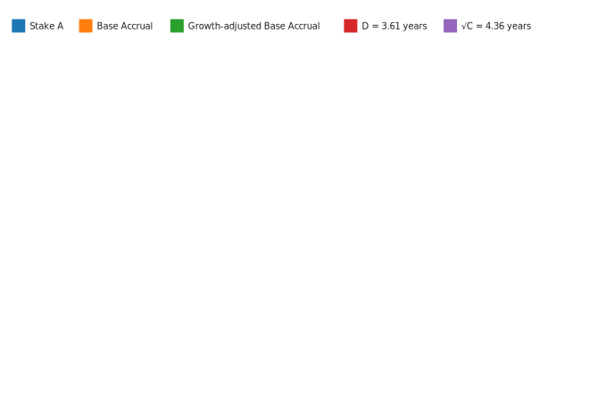

(a) Base accrual (Total Stake = 55.00%, Growth = 1.75%/Year).

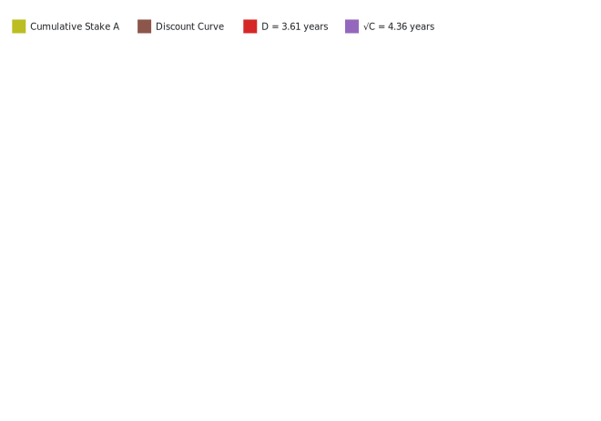

(b) Discount rates.

Figure 4: Example of base accrual.

For visualising the sensitivity of overall **A** base accrual with
respect to staking and duration,
<a href="#fig-growth-rate" class="quarto-xref">Figure 5</a> assumes a
single duration over the staking range to provide an approximation of
growth $\Delta S \approx Z \, S$.

Figure 5: **A** annual growth rate $\Delta S$ from base accrual.

#### Protocol Coordination Voting Power

Protocol coordination voting power can be derived from two participation
cohorts:

1.  Time-locked **A** tokens: $S_t$

2.  Staked liquidity in the **A**-**G** pair
    **AG** (see
    <a href="#sec-liquidity-mechanics" class="quarto-xref">Section 3.3</a>),
    defined here as $A_{Gt}$, representing the quantity of **A** tokens
    held in the liquidity pool expressed as a proportion of circulating
    supply.

Voting power is allocated by lock or stake duration, and applied to the
respective balance of **A** tokens:

1.  Voting weights for time-locked **A** tokens $v_t$:

    $$
     v_t = Z_t \, S_t
      \qquad(11)$$

2.  Voting weights for staked liquidity $w_t$:

    $$
     w_t = Z_t \, A_{Gt}
      \qquad(12)$$

3.  Voting power for time-locked **A** tokens $V_t$:

    $$
     V_t = \frac{v_t}{\sum_{j=1}^{40} (v_j + 2 w_j)}
      \qquad(13)$$

4.  Voting power for staked liquidity $W_t$:

    $$
     W_t = \frac{w_t}{\sum_{j=1}^{40} \left( \frac 1 2 v_j + w_j \right)}
      \qquad(14)$$

### Carbon Inventory Mechanics

The carbon inventory layer ultimately swaps carbon through a set of
smart contracts, driven by carbon supply, demand, and user inputs. The
combined allocations of **A** and **G** tokens create a dynamic
real-time execution terms curve for each carbon class.

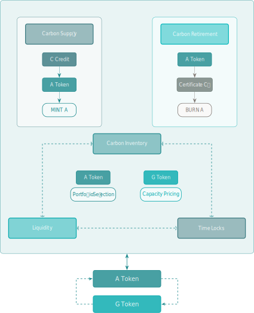

Figure 6: Klima 2.0 carbon inventory mechanics.

#### Carbon Supply

*User swaps carbon credits for **A** tokens.*

##### Existing Carbon in the Inventory

Both **A** tokens and **G** tokens may be allocated to specific carbon
classes ${i \in \{1, 2, 3, \dots, n\}}$ and these are independent
allocations between the two tokens.

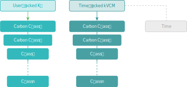

Figure 7: Token staking class structure.

For a carbon class quantity to be supplied to the protocol, it must have
a strictly positive quantity of **A** tokens allocated to that carbon
class, otherwise there is no defined rate, and the carbon cannot be
swapped.

Defining:

- $C_i$: Total tonnes of carbon class $i$ currently held in the
  inventory.

- $A_i$: **A** tokens allocated to carbon class $i$ expressed as a
  proportion of the outstanding supply of **A** tokens, where
  ${\sum A_i = A}$.

- $G_i$: **G** tokens allocated to carbon class $i$ expressed as a
  proportion of the outstanding supply of **G** Tokens.

Where $\Delta C_i$ is expressed as the relative increment to its
respective pool balance, the amount of **A** tokens issued for carbon,
$\Delta A$, expressed as a proportion of current supply, is determined
as:

$$
\ln(1 + \Delta A) =
  \left( A_i - \frac{A_i^2 \, (1 - G_i)^2}{2} \right) \ln(1 + \Delta C_i)
 \qquad(15)$$

Denoting the expression on the right hand side of
<a href="#eq-a-change-intermediary-step"
class="quarto-xref">Equation 15</a> as $\mathsf{RHS}$:

$$
\Delta A = \exp(\mathsf{RHS}) - 1
 \qquad(16)$$

Finally, $\Delta A$ is applied to the outstanding supply of **A** to
solve for token quantities.

<a href="#fig-a-price-curves" class="quarto-xref">Figure 8</a>
illustrates the **G** token’s capacity to maintain the initial execution
terms of the **A** token. The data has been normalised in
<a href="#fig-a-price-curves-normalised"
class="quarto-xref">Figure 9</a> to $\Delta C_i \, A_i$.

Figure 8: **A** price curves ($\Delta A$).

Figure 9: Normalised **A** price curves.

Noting that the sensitivity to $G_i$ increases as $A_i$ increases and
the effects become more pronounced as $\Delta C_i$ increases.

##### Zero Carbon Scenario

There are circumstances when there is zero carbon held in the inventory
for a particular class, i.e. ${C_i = 0}$, which invalidates the
calculation of $\Delta C_i$ and a different approach is required.

Taking $\Delta C_\emptyset$ as the tonnes of carbon tokens (implying an
existing balance of 1 tonne) to be supplied for any carbon class that
has a strictly positive **A** allocation $A_\emptyset$, together with
**G** allocation $G_\emptyset$:

$$
\Delta A =
  \frac{\Delta C_\emptyset}{1 + \Delta C_\emptyset} \,
  \left( A_\emptyset - \frac{A_\emptyset^2 (1 - G_\emptyset)^2}{2} \right)^2
 \qquad(17)$$

Figure 10: **A** price curves ($\Delta A$) in the zero carbon scenario.

Figure 11: Normalised **A** price curves in the zero carbon scenario.

#### Carbon Credit Retirements

*User swaps **A** tokens for carbon retirement certificates.*

##### Weighted Carbon Class

For retiring carbon that is *weighted*, that is for which there is a
strictly positive **A** token allocation, an **A** token holder can
extract the carbon class retirement certificate of their choice $C_i$:

$$
\ln(1 + \Delta C_i) =
  \frac{-\ln(1 + \Delta A)}{A_i + \frac 1 2 A_i^2 \, (1 - G_i)^2}
 \qquad(18)$$

As before, denoting the expression on the right hand side of
<a href="#eq-carbon-change-intermediary-step"
class="quarto-xref">Equation 18</a> as $\mathsf{RHS}$:

$$
\Delta C_i = \exp(\mathsf{RHS}) - 1
 \qquad(19)$$

Figure 12: Proportion of carbon retired.

<a href="#fig-proportion-of-carbon-retired"
class="quarto-xref">Figure 12</a> shows the cost of carbon increasing
with $A_i$ and decreasing with $G_i$.

##### Unweighted Carbon Class

A retirement certificate for a carbon class with a zero **A** allocation
cannot be extracted from the inventory by swapping in **A** tokens.

##### Round Trip Difference

Any difference between the **A** tokens issued in connection with carbon
intake and the **A** tokens burnt in connection with retirement is
reflected solely as a change in the circulating supply of **A** tokens,
according to the above protocol rules. No margin, profit, or financial
surplus is retained or extracted by the protocol or any privileged
entity.

<a href="#fig-carbon-difference" class="quarto-xref">Figure 13</a> below
shows the difference captured on a ‘round trip’ by the system where
$\varepsilon$ is the proportion retained:

Figure 13: Carbon ‘difference’.

<a href="#fig-carbon-difference-components"
class="quarto-xref">Figure 14</a> shows the component difference
contributions on a carbon supply and purchase round trip of a carbon
retirement certificate.

(a) Carbon ‘difference’ component $\Delta A$.

(b) Carbon ‘difference’ component $\Delta C$.

Figure 14: Carbon ‘difference’ components.

### Liquidity Mechanics

Both **A** and **G** tokens can be used for providing liquidity.

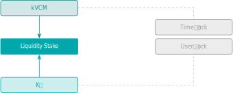

Figure 15: Token liquidity and execution structure.

There are two core liquidity pools:

1.  An AMM 50:50 pairing of **A** and **G** tokens: pool
    **AG**.

2.  A hard currency USDC denoted as **Q** paired with **A**: pool
    **AQ**.

#### Liquidity Fees

The **AQ** pool will have its own set of
fees in the standard way.[^1]

The **AG** pool has different economics as
the assets are highly correlated since they represent the same economy.
For this reason, the fees are extremely low.

By staking liquidity (liquidity provider tokens) to the **standard
durations**, both pools may receive a distribution of **A** tokens
determined from
<a href="#sec-kvcm-incentives" class="quarto-xref">Section 3.3.2</a>
below. This is an <u>additional</u> primary issuance to the Base Accrual
already discussed.

#### kVCM Incentives

In addition to the base accrual mechanism, **kVCM** incentives are
distributed to user-locked **G** token holders and staked liquidity
providers of **A** and **G** tokens.

As we have seen, a higher allocation of **G** tokens, $G_i$, for a
carbon class increases the protocol’s capacity to process additional
carbon activity without materially altering the execution terms. As a
consequence, the relationship between the carbon class selected under
$G_i$ and the **A** strengthens. If we consider $G_i$ as an estimate of
residual or idiosyncratic sensitivity in the carbon class, we can
calculate an inventory beta $\beta$ from the implied betas of each
carbon class $i$.

$$
\beta = \sqrt{\sum_{i=1}^n A_i - A_i \, (1 - G_i)^2}
 \qquad(20)$$

The inventory $\beta$ determines a sensitivity factor for the liquidity
pools of **A**.

For intuition, the map in
<a href="#fig-range-of-beta-i" class="quarto-xref">Figure 16</a> shows
the various outputs of the function per carbon class.

Figure 16: Range of $\beta_i$.

The table and figure below show an example of the effects on $\beta$ of
allocating large $G_i$ values to small $A_i$ values where the shift in
$G_i$ results in a lower $\beta$ (0.27 from 0.55) with no change to
total **G** and **A** allocations.

| Class | 1 | 2 | 3 | 4 | $\beta$ |
|:---|:---|:---|:---|:---|:---|
| $A_i$ | 0.50 | 0.20 | 0.10 | 0.05 |  |
| Initial $G_i$ | 0.30 | 0.10 | 0.05 | 0.01 |  |
| Initial $\beta_i^2$ | 0.2550 | 0.0380 | 0.0098 | 0.0010 | 0.5511 |
| New $G_i$ | 0.01 | 0.05 | 0.10 | 0.30 |  |
| New $\beta_i^2$ | 0.0100 | 0.0195 | 0.0190 | 0.0255 | 0.2719 |
| $\Delta G_i$ | (0.29) | (0.05) | 0.05 | 0.29 |  |
| $\Delta \beta_i^2$ | (0.2451) | (0.0185) | 0.0092 | 0.0245 |  |

Table 2: Effect on $\beta$ from outsized **G** allocation.

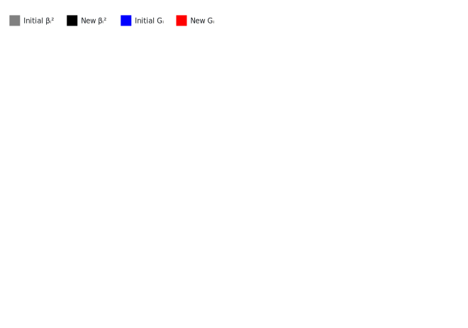

Figure 17: Example of **G** allocation on $\beta$.

<a href="#fig-example-of-g-stake-on-beta"
class="quarto-xref">Figure 17</a> shows the effect of **G** allocation
on $\beta$ as a function of **A** allocation; that is to say that a
large $G_i$ stake on a small $A_i$ stake has limited
effects (notwithstanding other consequential factors).

#### Allocation of kVCM incentives

The full issuance of **A** tokens is depicted below, including now the
**A** incentives for the liquidity pools.

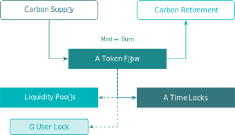

Figure 18: **A** token flow structure.

#### Share of kVCM incentives

The **kVCM** incentives are shared between user-locked **G** tokens,
**AG**. and
**AQ** pools, with shares $\lambda_{GG}$,
$\lambda_G$, and $\lambda_Q$ respectively.

Defining:

- $G_G$: Total **G** tokens in the **AG**
  pool, expressed as a proportion of the outstanding supply of **G**.

- $A_G$: Total **A** tokens in the **AG**
  pool, expressed as a proportion of the outstanding supply of **A**.

- $A_Q$: Total **A** tokens in the **AQ**
  pool, expressed as a proportion of the outstanding supply of **A**.

The allocation to user-locked **G** tokens, $\lambda_{GG}$:

$$
\lambda_{GG} = \frac{1 - A_Q}{1 + \left( \frac{\sum_{i=1}^{n}{G_i}}{G_G} \right)^2}
 \qquad(21)$$

Figure 19: **G** stake allocation (assuming $G_G = 1 - G_i$).

Noting the relationship between $G$ and $\beta$, and particularly if
$G = 0$, $\beta = 0$.

The residual share, $1 - \lambda_{GG}$, is split between the liquidity
pools:

$$
\lambda_G = (1 - \lambda_{GG}) \frac{2 A_G}{2 A_G + A_Q \sqrt 2}
 \qquad(22)$$

For completeness:

$$
\lambda_Q = 1 - \lambda_{GG} - \lambda_G
 \qquad(23)$$

Figure 20: Liquidity pool split $\lambda_G, \lambda_Q$.

#### kVCM Incentives Distribution

For $\lambda_{GG}$, $\lambda_G$, $\lambda_Q$ we apply $\beta$:

$$
\Lambda_X = \lambda_X \, \beta, \quad \text{for } X \in \{GG, G, Q\}
 \qquad(24)$$

Taking $b$ as a discount parameter:

$$
b = \frac{\sum_1^{40} Z_t \, S_t \, B_t}{\sum_1^{40} Z_t \, S_t }
 \qquad(25)$$

The total **kVCM** incentive tokens $R_\lambda$:

$$
R_\lambda = b \, R \, (\Lambda_{GG} + \Lambda_G + \Lambda_Q)
 \qquad(26)$$

The allocations of $R_\lambda$ are pro-rata to $\Lambda_{GG}$,
$\Lambda_G$, $\Lambda_Q$, and thereafter:

1.  Locked **G**: $\Lambda_{GG}$ in proportion to **G**.

2.  Locked **AG**,
    **AQ** tokens are allocated a
    weighting $G_t$, $Q_t$ depending on their time bucket $t$:

    $$
     G_t = \frac{Z_t \, L_{Gt} \, B_t}{\sum Z_t \, L_{Gt} \, B_t}
      \qquad(27)$$

    $$
     Q_t = \frac{Z_t \, L_{Qt} \, B_t}{\sum Z_t \, L_{Qt} \, B_t}
      \qquad(28)$$

    Where $L_{Gt}$, $L_{Qt}$ are the proportion of all liquidity locked
    in each time bucket for **AG** and
    **AQ** respectively.

Thereafter each time bucket allocation is proportionate to staked
liquidity provider token holdings.

## Klima 2.0 Token Distribution

### Planned Allocations

| Cohort        | Proportion | Quantity (m) |
|:--------------|-----------:|-------------:|
| Klima Holders |      87.5% |         17.5 |
| DAO/Treasury  |      10.0% |          2.0 |
| 01X           |       2.5% |          0.5 |
| **Total**     | **100.0%** |     **20.0** |

Table 3: **kVCM** token.

| Cohort | Proportion | Quantity (m) | Liquidity |
|:---|---:|---:|:---|
| Klima Holders | 40.0% | 40.0 | Logistic Vesting 48 months |
| Ecosystem Grant | 5.0% | 5.0 | Logistic Vesting 48 months |
| Programmatic Incentives | 40.0% | 40.0 | Incentive Curve |
| pKlima Holders | 3.0% | 3.0 | Logistic Vesting 48 months |
| DAO/Treasury | 4.5% | 4.5 | 24 month locked LP of **AG** |
| 01X | 2.5% | 2.5 | 24 month locked LP of **AG** |
| Product Design and Development | 5.0% | 5.0 | Logistic Vesting 48 months |
| **Total** | **100.0%** | **100.0** |  |

Table 4: **K2** token.

Figure 21: **K2** token allocations.

### Programmatic Incentive Curve

The incentive issuance is built on a logistic function,
$\operatorname{P}$, to generate total proportion of supply in issue. It
is calibrated from the initial issuance at TGE $P_0$ and the inflection
point time $T$ where 50% of **G** token incentives have been released.

Setting $x_0$ from the initial supply parameter:

$$
x_0 = \ln\left( \frac{P_0}{1 - P_0} \right)
 \qquad(29)$$

With $x_t$ at time point $t \in (0, \infty)$:

$$
x_t = x_0 \, \left( 1 - \frac t T \right)
 \qquad(30)$$

Giving supply function $\operatorname{P}(t)$ as:

$$
\operatorname{P}(t) = \frac{\exp(x_t)}{\exp(x_t) + 1}
 \qquad(31)$$

$P_0$ set at 7% and $T$ at 24 months:

Figure 22: Incentive Issuance

Figure 23: **K2** token circulating supply over time.

(a) Total supply (stacked).

(b) Total supply (unstacked).

Figure 24: **K2** token total supply over time.

Figure 25: **K2** supply differential (stacked).

### Share of K2 Incentives

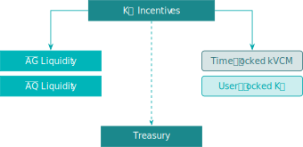

Figure 26: **K2** token incentive distribution structure.

The **relative utilisation** measurement factor $\upsilon$ is calculated
as follows.

Defining initially:

- $G$: Total **G** tokens staked expressed as a proportion of the
  circulating supply, $G \in [0, 1]$.

- $L$: Total **G** tokens held in the
  **AG** pool expressed as a proportion of
  circulating supply, $L \in (0, 1]$.

Where $\upsilon = 0$ if $G + L = 0$, otherwise:

$$
\upsilon = \left( \frac{2 G L}{G^2 + L^2} \right)^2
 \qquad(32)$$

Figure 27: Upsilon $\upsilon$ range of values.

The **absolute utilisation** parameter $\eta$ is defined as $\eta = 0$
if $G + L = 0$, otherwise:

$$
\eta = \frac{2 G L}{G (1 - G) + L ( 1 - L)}
 \qquad(33)$$

Figure 28: Eta $\eta$ range of values.

Incentives $I$ are allocated as follows:

#### Treasury

The allocation to the Treasury $I_T$ is the imbalance generated from
$\upsilon$:

$$
I_T = 1 - \upsilon \, \eta
 \qquad(34)$$

#### Post Treasury

The residual post-treasury allocation is shared four ways within 2
buckets:

1.  Time-locked **A** & user-locked **G** tokens

    Where $S$ is the proportion of time-locked **A** tokens (as defined
    previously in
    <a href="#sec-base-accrual" class="quarto-xref">Section 3.1.1</a>):

    1.  Time-locked **A**, $I_S$:

        $$
         I_S = S \, \frac{L^2}{G^2 + L^2}
          \qquad(35)$$

    2.  User-locked **G**, $I_G$:

        $$
         I_G = (1 - S) \, \frac{L^2}{G^2 + L^2}
          \qquad(36)$$

2.  Liquidity

    With $\lambda_G$, $\lambda_Q$, $\lambda_{GG}$ as defined in
    <a href="#sec-share-of-kvcm-incentives"
    class="quarto-xref">Section 3.3.4</a>:

    3.  **AG** pool $I_{AG}$:

        $$
         I_{AG} = \frac{\lambda_G}{1 - \lambda_{GG}} \, \frac{G^2}{G^2 + L^2}
          \qquad(37)$$

    4.  **AQ** pool $I_{AQ}$:

        $$
         I_{AQ} = \frac{\lambda_Q}{1 - \lambda_{GG}} \, \frac{G^2}{G^2 + L^2}
          \qquad(38)$$

(a) Time-locked **A** and user-locked **G** allocations.

(b) Liquidity pools allocations

Figure 29: Share of non-treasury incentives $I_S$, $I_G$, $I_{AG}$ and
$I_{AQ}$.

Figure 30: Treasury incentives $I_T$.

[^1]: Note the development of liquidity pool pricing functionality may
    be applicable.
