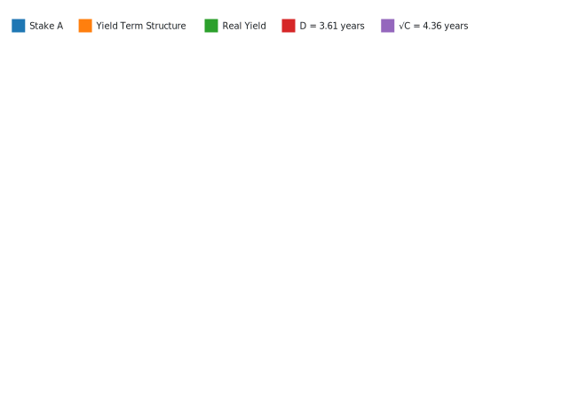
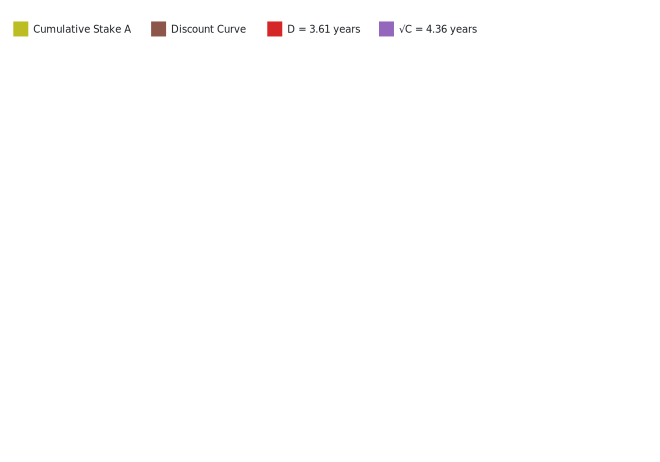
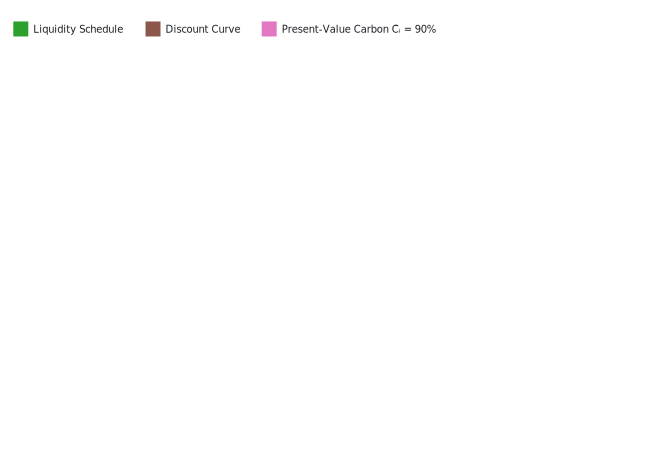
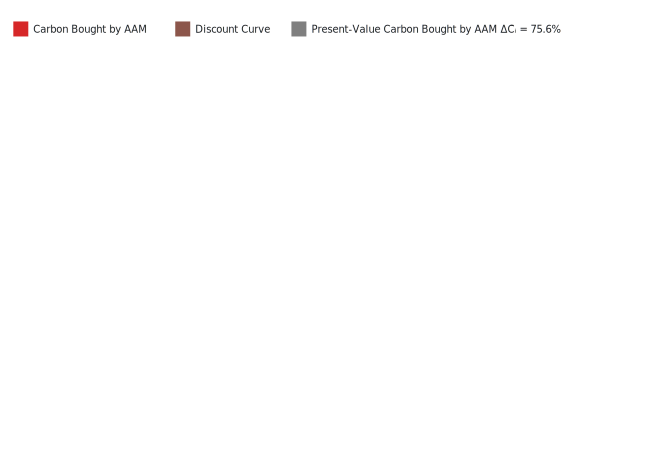
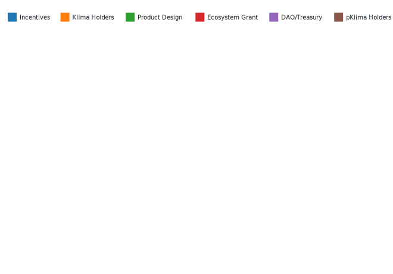

# Klima 2.0
The Dark Sole Enterprise Ltd <ds@darksole.vip>  
with contributions from the Klima and Carbonmark teams

21 Jan 2026 (Version 1.48)

**Copyright Notice**

This document represents original work by dark_sole <ds@darksole.vip>.
While contributions from others are gratefully acknowledged, all
intellectual property rights remain with the author. The models,
algorithms, processes, products, methodologies, and concepts described
herein are licenced exclusively for commercial use by the Klima
Protocol. No other party may implement, copy, modify, or derive works
from these materials without explicit written permission from the
author.

© 2025 dark_sole. All rights reserved.

## Prologue

Klima 2.0 is an autonomous, rules-based coordination protocol designed
to support the retirement of carbon credits through transparent pricing,
continuous execution, and onchain settlement.

It is not a financial product, investment vehicle, or asset management
system, but a piece of market infrastructure that enables carbon supply
and retirement demand to interact under predefined conditions.

The protocol operates through a dual-token architecture that facilitates
coordination without discretionary control: **kVCM** functions as the
internal unit of account and pricing reference for protocol-facilitated
carbon retirement, while **K2** provides signalling inputs related to
system capacity. Together, these tokens inform protocol parameters
through deterministic smart-contract logic. This architecture enables
the protocol to:

- price and intake eligible, tokenised carbon credits according to
  transparent, onchain rules;

- make acquired credits available exclusively for irreversible
  retirement;

- coordinate liquidity provision and participation incentives required
  for continuous operation.

Participant actions such as locking tokens, signalling preferences, or
providing liquidity serve as non-custodial inputs into a coordination
mechanism that adjusts protocol parameters within predefined bounds.
These inputs do not confer ownership rights, redemption rights, or
claims on protocol-held carbon, nor do they constitute discretionary
management of assets.

The protocol consists of three interdependent functional layers:

- a carbon inventory layer that holds credits solely for the purpose of
  facilitating retirement;

- a governance layer that aggregates participant signals to inform
  pricing and intake parameters; and

- a liquidity layer that supports entry and exit from the system through
  external markets.

These layers are designed to operate together as a self-contained
system, adjusting to observable supply and retirement demand without
reliance on external oracles, manual intervention, or fee-extractive
intermediaries.

Klima 2.0 abstracts complex carbon market interactions into a
transparent and auditable execution framework, enabling participants to
interact with carbon retirement infrastructure directly,
programmatically, and on equal terms.

Any economic effects arising from protocol activity result from
predefined rules and market interaction, rather than from asset
ownership, portfolio management, or profit extraction.

## Klima 2.0

KlimaDAO launched in 2021 on the Polygon blockchain as an early
experiment in applying tokenisation and onchain liquidity to voluntary
carbon markets. The initial design centred on the KLIMA token and a
treasury-based mechanism intended to bootstrap liquidity and
participation in a nascent onchain carbon ecosystem.

That first iteration played a meaningful role in demonstrating that
carbon credits could be represented, transferred, and retired using
blockchain infrastructure. It also catalysed the development of a
broader ecosystem of tools and services, including integrations with
multiple carbon registries, marketplaces and point-of-sale interfaces,
APIs for third-party applications, and direct onchain issuance by
project developers.

Over time, it became clear that the original architecture was not well
suited to serving large-scale, enterprise carbon buyers or to supporting
continuous, rules-based market operation without manual intervention. In
particular, treasury-centric designs introduced complexity, opacity, and
governance challenges that limited scalability and operational clarity.

Klima 2.0 is a ground-up redesign informed by these lessons. Rather than
relying on treasury management or discretionary allocation, the new
protocol is structured as neutral, non-extractive market infrastructure
focused exclusively on facilitating carbon retirement through
transparent pricing, programmatic settlement, and open participation.

The Klima 2.0 protocol replaces treasury-backed mechanisms with a
rules-based coordination model that uses protocol-native tokens to
parameterise pricing bounds, intake capacity, and participation
incentives. Carbon credits handled by the protocol are acquired solely
to fulfil retirement demand and are not held, traded, or managed for
financial gain.

This shift reflects a deliberate move away from capital-centric designs
toward infrastructure that prioritises auditability, predictability, and
long-term operational resilience. Klima 2.0 is intended to function as a
shared execution layer for carbon markets, enabling suppliers, buyers,
and integrators to interact under predefined conditions without reliance
on discretionary intermediaries.

### Protocol Tokens

Klima 2.0 operates using two protocol-native tokens, **kVCM** and
**K2**, which together enable rules-based coordination of pricing,
capacity, and participation within the system. These tokens do not
confer ownership rights, redemption rights, or claims on
protocol-handled carbon, and do not represent investment interests.

**kVCM** functions as the internal unit of account and pricing reference
for protocol-facilitated carbon retirement, while **K2** provides
signalling inputs related to system capacity. Both tokens are used
exclusively to parameterise protocol behaviour through deterministic
smart-contract logic.

**kVCM** tokens set core allocation choices, whereas **K2** acts as the
calibration mechanism for inventory development.

### High-Level Architecture

Klima 2.0 is composed of three interdependent functional layers that
together support continuous, non-discretionary operation:

1.  **Carbon Inventory Layer**:

    - Accumulates carbon credits by minting **kVCM**.
    - Sells carbon certificates by burning **kVCM**.
    - Prices carbon based on the system’s code.

    Carbon credits handled by the protocol cannot be withdrawn,
    transferred, or resold.

2.  **Governance Layer**:

    - **kVCM** holders may **time-lock** their **kVCM** for a fixed time
      period and become eligible to select carbon assets for the
      inventory.
    - This action creates a **kVCM** Base Accrual curve, which is
      distributed to the time-locked holders. This is utilised to derive
      discount rates and governance weightings.

3.  **Liquidity Layer**:

    - **kVCM** and **K2** holders are able to pair their tokens
      together, or in the case of **kVCM** with USDC, in order to
      generate liquidity fees.
    - Staking the resulting liquidity provider tokens may generate a
      share of protocol incentives.
    - Liquidity locked in the **kVCM**/**K2** liquidity pool
      participates in general governance alongside time-locked **kVCM**
      holders.

These layers operate together as a self-contained system that responds
only to its own observable state, without reliance on external oracles
or centralised intervention.

### Incentives and Participation

The protocol issues incentives to participants who provide defined
services necessary for system operation.

#### kVCM Incentives

**kVCM** incentives are continuously emitted to:

1.  Time-locked **kVCM** (‘**kVCM** Base Accrual’).

2.  User-locked **K2**.

3.  Both **kVCM** and **K2** liquidity providers.

#### K2 Incentives

The supply of K2 is allocated to stakeholders at various rates,
depending on overall system balances:

1.  Time-locked **kVCM**.

2.  User-locked **K2**.

3.  Both **kVCM** and **K2** liquidity providers.

### Carbon Inventory

The protocol’s carbon inventory layer accumulates and distributes
carbon. It is driven by parameters determined by its rules-based smart
contracts, and token holder actions.

Figure 1: Klima 2.0 Carbon Inventory.

Carbon credits are acquired from suppliers, and consumed by offset
buyers. Carbon credits are grouped by pre-defined classifications called
**carbon classes**. The protocol does <u>not</u> sell carbon credits.

Aggregate token holder allocations collectively set the parameters for
the pricing of **each class** by defining:

- Inventory weighting.

- Capacity.

Additional **global** parameters are also determined by the aggregate
allocations, including the **kVCM** incentive curve.

There are no oracles or external inputs required for Klima 2.0 as it is
fully autonomous and responds to its own native state of token balances.

The protocol does not facilitate the trading of unretired carbon credits
and does not engage in discretionary allocation, resale, or optimisation
of carbon inventory.

### Tokens

Locking or staking the protocol’s tokens allows participants to signal
pricing preferences and capacity parameters within the protocol.
However, holding or locking the tokens does not represent risk
ownership, profit participation, or exposure to carbon price movements.
Participants may receive protocol incentives for performing defined
coordination functions, distributed according to transparent,
rules-based mechanisms.

Together, **kVCM** and **K2** enable the protocol to operate as neutral,
non-extractive infrastructure, coordinating participation and execution
without discretionary management.

#### kVCM

**kVCM** is the protocol’s primary utility token. Its supply is <u>not
capped</u>: it grows when new carbon is supplied to the protocol, and
contracts when it is retired.

- When **time-locked**:

  - It *may* vote for carbon classes for inventory weighting.

  - It receives **kVCM** base accrual and **K2** incentives.

  - In aggregate, it determines the rate of incentive issuance.

- **Transactional** usage:

  - **Mint**: when suppliers deliver carbon to the protocol.

  - **Burn**: when credits are retired from the protocol.

- When **staked** in liquidity pools it is also eligible for incentives,
  based on the position’s relative share.

Figure 2: Token utility.

#### K2

**K2** is a <u>fixed-supply</u> token distributed programmatically over
time.

- When **user-locked**:

  - It *may* vote for carbon classes to reduce the difference between
    execution terms on carbon intake and retirements.

  - It receives **kVCM** and **K2** incentives.

  - In aggregate, it influences the rates of incentive issuance.

- When **staked** in the kVCM/K2 liquidity pool it is also eligible for
  incentives, based on the position’s relative share.

#### Utility Functions

The **kVCM** token has <u>two</u> utility functions which are not
independent:

Figure 3: **kVCM** utility functions.

1.  **Time lock**: The **kVCM** token is locked for a specific period of
    time which determines a kVCM ‘base accrual’ rate. This cannot be
    amended.

2.  **Price allocation**: Collective selection of carbon classes by
    **kVCM** allocations determines the **real-time** execution ratio
    for carbon intake and retirements, in kVCM terms. This selection can
    be amended and withdrawn at any time to allow modulation of protocol
    parameters.

The **K2** token also has <u>two</u> utility functions:

1.  **User lock**: The **K2** token remains locked for at least 24
    hours.

2.  **Capacity allocation**: Collective selection of carbon classes by
    **K2** allocations determines the rate of issuance or retirement of
    **kVCM** for the specified carbon class. More capacity allocations
    on a given carbon class reduce the impact that new transactions have
    on the execution ratio created by price allocations.

Both tokens facilitate the carbon market to function efficiently, with
the **kVCM** token responsible for setting execution ratios, and the
**K2** token modulating capacity.

### Initialisation of the kVCM Token

The Klima Protocol has approximately **20 million tonnes** of carbon
credits in its treasury as assets, a part of which will be used to
create the initial issuance of **kVCM** tokens upon launch of Klima 2.0.

<table class="column-body-outset">
<colgroup>
<col style="width: 10%" />
<col style="width: 15%" />
<col style="width: 75%" />
</colgroup>
<thead>
<tr>
<th style="text-align: left;">Token</th>
<th style="text-align: left;">Amount</th>
<th style="text-align: left;">Notes</th>
</tr>
</thead>
<tbody>
<tr>
<td style="text-align: left;"><strong>kVCM</strong> 
<strong>A</strong> Token</td>
<td style="text-align: left;">20 million</td>
<td style="text-align: left;"><ul>
<li>Supply expands and contracts perpetually.</li>
<li>87.5% of initial supply available to existing KLIMA holders.</li>
<li>Initially created approximately on a 1:1 basis with carbon tonnes
held.</li>
<li>Issues on carbon received, and burns on barbon retired.</li>
</ul></td>
</tr>
<tr>
<td style="text-align: left;"><strong>K2</strong> 
<strong>G</strong> Token</td>
<td style="text-align: left;">100 million</td>
<td style="text-align: left;"><ul>
<li>Fixed supply.</li>
<li>40% put into programmatic issuance as <strong>K2</strong> Incentives
yield over time.</li>
<li>40% for existing KLIMA holders.</li>
</ul></td>
</tr>
</tbody>
</table>

Table 1: Token Summary

### End Users

1.  **Carbon Credit Sellers**

    Those wishing to monetise spot- or forward-delivery classes of
    carbon.

    ***Portfolio Manager**: Continuously acquires carbon credits using
    an autonomous pricing strategy based on carbon class, delivery and
    token balances, issuing new **kVCM** tokens as consideration to
    build the carbon portfolio.*

2.  **Offset Buyers**

    Those wishing to obtain carbon offset certificates by retiring
    carbon credits from the portfolio.

    ***Portfolio Manager**: Continuously sells carbon offset
    certificates, by burning **kVCM** tokens and issuing carbon offset
    certificates by retiring the quantity in the registry.*

3.  **Investors**

    Those who wish to own a liquid or yielding locked fixed-maturity
    financial exposure to a basket of carbon assets.

    ***Time-Locked Market**: Provides a daily time-based yield for those
    time-locking **kVCM** tokens called Base Accrual.*

4.  **Liquidity Providers**

    Those who wish to generate liquidity fees on their portfolio of
    Klima 2.0 assets coupled together or with USDC.

    ***Liquidity Market**: Staked liquidity providers are incentivised
    by the **kVCM** Risk Premium calculated from system metrics to
    compensate them for risk.*

5.  **Active Portfolio Optimisation**

    ***K2 and kVCM asset selection**: The incentives and allocations are
    designed for those who wish to participate in overall risk
    management to collectively resolve for the optimal portfolio risks.*

### Automated Asset Manager Highlights

- **Decentralised architecture**:

  The Automated Asset Manager is smart-contract based, fully autonomous
  as to pricing and distribution of its assets with governance power
  held by risk-based capital.

- **Adverse selection**:

  The Automated Asset Manager does not permit the direct purchase of
  carbon credits from its portfolio (only carbon offset certificates).

- **Liquid carbon**:

  Users with liquid carbon credits can always access carbon offset
  certificates through the registry, hold the specific carbon credits or
  sell back to the Automated Asset Manager if required. Secondary
  markets and utility for liquid carbon credits may emerge over time.

- **Implied spreads**:

  The Automated Asset Manager purchases carbon at relative discounts
  based on capacity pricing and forward discount rates folding natural
  returns into the portfolio capital.

- **Dual token structure**:

  Whilst the **kVCM** token reflects asset economics, the **K2** token
  is essential for optimising pricing capacity and in return
  **maximising risk-adjusted spreads** for the portfolio. Since its
  earnings power is a function of the **kVCM** token value, its role as
  this spread optimiser is truly economically aligned and as such
  fundamental values of **kVCM** and **K2** are highly correlated.

## Core Economic Pillars

From this Section, we refer to **kVCM** and **K2** tokens as **A** and
**G** respectively.

The three tenets of Klima 2.0 enable the model to find equilibrium
through continuous dynamic feedback loops and system balances. There is
no oversight or centralised management entity with discretionary powers.

1.  **Time-Locked Market**: **A** token holders stake tokens until a set
    expiry to create floating yield time locks and have the ability to
    select carbon classes for portfolio weighting.

    - The collective temporal staking pattern produces a **Synthetic
      Yield** curve in **A** tokens to reward time-locked token holders,
      as well as price the forward curve for the AAM.

    - Only **A** tokens participate in the Time-Locked Market.

2.  **Portfolio Manager**: The Portfolio Manager swaps its own token
    **A** for carbon credits **C** (in) or carbon offset certificates
    **C\*** (out) to build a portfolio of carbon credits.

    - Both **time-locked** **A** and **user-locked** **G** are used in
      the portfolio manager whereby allocating **A** determines the
      pricing of any given carbon class, and allocating **G** determines
      the rate of acquisition (and disposal).

      *Only time-locked **A** tokens can participate in portfolio
      weighting although it is not mandatory.*

    - Forward-delivery carbon (for a set of fixed dates out to 10 years)
      is transacted simultaneously with spot liquid carbon.

3.  **Liquidity Market**: Here the tokens are traded in two core
    liquidity pairs with various incentives available to staked
    liquidity providers (**LPs**), including a **Risk Premium**
    generated by the Time-Locked Market synthetic yield.

    - **AG**: Native token swap **A** and
      **G**.

    - **AQ**: The asset token **A** with
      USDC **Q**.

    The Liquidity Market provides the complementary facility to the
    Time-Locked Market and the critical relationship between the native
    tokens and the hard currency of USDC.

The Klima 2.0 system enables each participant in the various economic
pillars to act in the interests of their own capital and utility, which
through the harmonic model, enables price discovery, liquidity and
stability for carbon trading which creates positive reinforcement cycles
as catalysts for growth and scale.

### Time-Locked Market

Holders of **A** can time-lock their token until a maturity from the set
of **standard maturities**. Time locks expire every 90 days on a rolling
basis. There are always 40 maturities extending out to approximately 10
years.

- **Forward curve**: Aggregate time-locking determines the shape of the
  discount curve of the **A** token with regards to its purchasing rate
  of forward-delivery carbon.

- **Synthetic yield**: Time-locked **A** token holders receive a
  floating yield of new **A** tokens following the shape of this
  discount curve called **Base Accrual**. Base Accrual is calculated
  daily and accumulates to the principal.

- **Liquidity**: There is no early unlocking; all principal and
  accumulated yield is released only at time lock expiration.

**G** tokens are <u>not</u> involved in the Time-Locked Market. The
forward curve is agnostic to carbon class although only time-locked
**A** token holders can allocate their token to carbon classes for
portfolio pricing.

#### Synthetic Yield and Forward-Delivery Curve

Defining:

- $S$: Total time-locked **A** tokens expressed as a proportion of the
  outstanding supply of **A**.

- $S_t$: Total **A** tokens time-locked in maturity bucket $t$,
  expressed as a proportion of the outstanding supply of **A**, where
  ${\sum S_t = S}$, and $t$ is the index of standard maturities
  $t \in \{1, 2, 3, \dots, 40\}$.

- $E_t$: Time to expiry expressed in years.

Calculating curve parameters $D$ and $C$:

$$
D = \frac{1}{S} \sum_{t=1}^{40} S_t \, E_t
 \qquad(1)$$

$$
C = \frac{1}{S} \sum_{t=1}^{40} S_t \, E_t^2
 \qquad(2)$$

The shape of the synthetic yield curve is produced:

$$
\gamma_t = \max \left( \frac{E_t}{D} - \frac{E_t^2}{2 \, C}, \, 0 \right)
 \qquad(3)$$

Normalising $\gamma_t$ to $\hat \gamma_t$:

$$
\hat \gamma_t = \frac{\gamma_t}{\sum_{t=1}^{40} \gamma_t}
 \qquad(4)$$

With the cumulative sum of the normalised values expressed as
$\Gamma_t$:

$$
\Gamma_t = \sum_{i=1}^t \hat \gamma_i \quad \text{for } t = 1, \dots, 40
 \qquad(5)$$

The zero-coupon yield curve $Z_t$ is solved:

$$
Z_t = (1 - S) \, \frac{\Gamma_t}{E_t}
 \qquad(6)$$

Whereupon, the discount rate $B_t$ that forms the forward-delivery curve
is derived:

$$
B_t = \exp(-Z_t \, E_t)
 \qquad(7)$$

The yield due on time-locked **A** tokens is calculated daily and added
to the staked principal, hence the daily yield for each time bucket is
calculated:

$$
Y_t = \exp \left( \frac{Z_t}{365} \right) - 1
 \qquad(8)$$

Hence, any time-locked **A** stake $S_t$ will increase by $\Delta S_t$:

$$
\Delta S_t = S_t \, Y_t
 \qquad(9)$$

With the total **A** tokens created on a daily basis for time-locked
inflation as

$$
R = \sum_{t=1}^{40} \Delta S_t
 \qquad(10)$$

(a) Yield (Total Stake = 55.00%, Inflation = 1.75%).

(b) Discount rate.

Figure 4: Example of a Time-Locked Market state.

For visualising the sensitivity of overall **A** inflation rates with
respect to staking and duration,
<a href="#fig-inflation-rate" class="quarto-xref">Figure 5</a> assumes a
single maturity over the staking range to provide an approximation of
inflation $\Delta S \approx Z \, S$.

Figure 5: **A** inflation rate from time-locked token yields $\Delta S$.

#### Governance Weightings

Governance rights, for example the whitelisting (and blacklisting) of
carbon classes, and any other matter requiring token stakeholder voting,
are allocated to two cohorts:

1.  Time-locked **A** tokens: $S_t$

2.  Staked liquidity in the **A**-**G** pair
    **AG** (see
    <a href="#sec-liquidity-markets" class="quarto-xref">Section 3.3</a>),
    defined here as $A_{Gt}$, representing the quantity of **A** tokens
    held in the liquidity pool expressed as a proportion of circulating
    supply.

Voting power is allocated by time and applied to the respective balance
of **A**:

1.  Initial voting weights for time-locked **A** tokens $v_t$:

    $$
     v_t = Z_t \, S_t
      \qquad(11)$$

2.  Initial voting weights for staked liquidity $w_t$:

    $$
     w_t = Z_t \, A_{Gt}
      \qquad(12)$$

3.  Final voting weights for time-locked **A** tokens $V_t$:

    $$
     V_t = \frac{v_t}{\sum_{j=1}^{40} (v_j + 2 w_j)}
      \qquad(13)$$

4.  Final voting weights for staked liquidity $W_t$:

    $$
     W_t = \frac{w_t}{\sum_{j=1}^{40} \left( \frac 1 2 v_j + w_j \right)}
      \qquad(14)$$

### Portfolio Manager

The Portfolio Manager’s role of swapping **A** for carbon is managed
through a set of smart contracts driven by allocation choices from the
token system, the balances of assets held, and the discount rates
generated by the Time-Locked Market.

The combined allocations of **A** and **G** tokens creates a dynamic
pricing matrix by carbon class and by time, enabling spot and forward
trading of carbon.

Figure 6: Klima 2.0 Portfolio Manager.

#### Purchase Carbon

*User swaps carbon credits for **A** tokens.*

##### Existing Carbon in the Portfolio

Carbon classes ${i \in \{1, 2, 3, \dots, n\}}$ are whitelisted through
governance by time-locked **A** token and staked
**AG** liquidity providers (see
<a href="#sec-governance-weightings"
class="quarto-xref">Section 3.1.2</a>).

For carbon pricing, both **A** tokens and **G** tokens may be allocated
to specific carbon classes $i$ and these are independent allocations
between the two-token systems.

Figure 7: Token staking class structure.

For a carbon class quantity to be sold to the Automated Asset Manager,
it must have a strictly positive quantity of **A** tokens allocated to
that carbon class, otherwise there is no price, and the carbon cannot be
sold.

Defining:

- $C_i$: Total tonnes of carbon class $i$ currently held in the
  portfolio.

- $A_i$: **A** tokens allocated to carbon class $i$ expressed as a
  proportion of the outstanding supply of **A** tokens, where
  ${\sum A_i = A}$.

- $G_i$: **G** tokens allocated to carbon class $i$ expressed as a
  proportion of the outstanding supply of **G** Tokens.

- $C_{it}$: The quantity of carbon class $i$ held in the Automated Asset
  Manager deliverable per maturity $t$ where $C_{i0}$ reflects the
  liquid quantity.

In order to determine the present-value quantity of carbon, $\bar C_i$,
we apply the discount curve from
<a href="#eq-discount-rate" class="quarto-xref">Equation 7</a> to the
liquidity schedule and sum the discounted holdings:

$$
\bar C_i = C_{i0} + \sum_{t=1}^{40} B_t \, C_{it}
 \qquad(15)$$

Figure 8: Carbon held in the portfolio.

Similarly, taking $\Delta C_{it}$ as the quantity of carbon $i$ to be
sold with a specific maturity index $t$:

$$
\Delta \bar C_i = \Delta C_{i0} + \sum_{t=1}^{40} B_t \, \Delta C_{it}
 \qquad(16)$$

Once standardised by the discount curve, trades can be aggregated in the
same class for the defined trade or auction period.

Figure 9: Carbon bought by the Portfolio Manager.

Where $\Delta \bar C_i$ is expressed as the relative increment to its
respective pool balance, the amount of **A** tokens issued to pay for
carbon, $\Delta A$, expressed as a proportion of current supply, is
determined as:

$$
\ln(1 + \Delta A) =
  \left( A_i - \frac{A_i^2 \, (1 - G_i)^2}{2} \right) \ln(1 + \Delta \bar C_i)
 \qquad(17)$$

Denoting the expression on the right hand side of
<a href="#eq-a-change-intermediary-step"
class="quarto-xref">Equation 17</a> as $\mathsf{RHS}$:

$$
\Delta A = \exp(\mathsf{RHS}) - 1
 \qquad(18)$$

Finally, $\Delta A$ is applied to the outstanding supply of **A** to
solve for token quantities.

<a href="#fig-a-price-curves" class="quarto-xref">Figure 10</a>
illustrates the **G** token’s capacity to maintain the initial portfolio
pricing of the **A** token. The data has been normalised in
<a href="#fig-a-price-curves-normalised"
class="quarto-xref">Figure 11</a> to $\Delta \bar C_i \, A_i$.

Figure 10: **A** price curves ($\Delta A$).

Figure 11: Normalised **A** price curves.

Noting that the sensitivity to $G_i$ increases as $A_i$ increases and
the effects become more pronounced as $\Delta \bar C_i$ increases.

##### Zero Carbon Scenario

There are circumstances when there is zero carbon held in the portfolio
for a particular class, i.e. ${C_i = 0}$, which invalidates the
calculation of $\Delta \bar C_i$ and a different approach is required.

Taking $\Delta \bar C_\emptyset$ as the tonnes of carbon tokens
(implying an existing balance of 1 tonne), adjusted for forward
discounting, to be sold for any carbon class that has a strictly
positive **A** allocation $A_\emptyset$, together with **G** allocation
$G_\emptyset$:

$$
\Delta A =
  \frac{\Delta \bar C_\emptyset}{1 + \Delta \bar C_\emptyset} \, 
  \left( A_\emptyset - \frac{A_\emptyset^2 (1 - G_\emptyset)^2}{2} \right)^2
 \qquad(19)$$

Figure 12: **A** price curves ($\Delta A$) in the zero carbon scenario.

Figure 13: Normalised **A** price curves in the zero carbon scenario.

#### Sell Offset Certificates

*User swaps **A** tokens for carbon offset certificates.*

##### Weighted Carbon Class

For retiring carbon that is *weighted*, that is for which there is a
strictly positive **A** token allocation, an **A** token holder can
extract the carbon class offset certificate of their choice $C_i$ but
the available pool is only the liquid carbon balance, namely the element
$C_{i0}$:

$$
\ln(1 + \Delta C_i) =
  \frac{-\ln(1 + \Delta A)}{A_i + \frac 1 2 A_i^2 \, (1 - G_i)^2}
 \qquad(20)$$

As before, denoting the expression on the right hand side of
<a href="#eq-carbon-change-intermediary-step"
class="quarto-xref">Equation 20</a> as $\mathsf{RHS}$:

$$
\Delta C_i = \exp(\mathsf{RHS}) - 1
 \qquad(21)$$

Figure 14: Proportion of carbon retired.

<a href="#fig-proportion-of-carbon-retired"
class="quarto-xref">Figure 14</a> shows the cost of carbon increasing
with $A_i$ and decreasing on $G_i$.

##### Unweighted Carbon Class

An offset certificate for a carbon class with a zero **A** allocation
cannot be extracted from the portfolio by swapping in **A** tokens.

##### Liquidation: $\Delta A = 1$

In the event that 100% of **A** tokens are placed into the burn
mechanism for carbon offset certificates, the balances of all carbon
held in the portfolio post-trade are distributed to all **G** token
holders.

<a href="#fig-carbon-spread" class="quarto-xref">Figure 15</a> below
shows the spread captured on a ‘round trip’ by the system where
$\varepsilon$ is the proportion retained:

Figure 15: Carbon ‘spread’.

<a href="#fig-carbon-spread-components"
class="quarto-xref">Figure 16</a> shows the component ‘spread’
contributions on a carbon sale and purchase round trip of a carbon
offset certificate.

(a) Carbon ‘spread’ component $\Delta A$.

(b) Carbon ‘spread’ component $\Delta C$.

Figure 16: Carbon ‘spread’ components.

### Liquidity Markets

Both **A** and **G** tokens can be used for providing liquidity.

Figure 17: Token liquidity and pricing structure.

There are two core liquidity pools:

1.  An AAM 50:50 pairing of **A** and **G** tokens: pool
    **AG**.

2.  A hard currency USDC denoted as **Q** paired with **A**: pool
    **AQ**.

#### Liquidity Fees

The **AQ** pool will have its own set of
fees in the normal way.[^1]

The **AG** pool has different economics as
the assets are highly correlated since they represent the same economy.
For this reason, the fees are extremely low.

By staking liquidity (liquidity provider tokens) to the **standard
maturities**, both pools may receive a distribution of **A** tokens
determined from the Risk Premium calculation below. This is an
<u>additional</u> primary issuance to the Base Accrual already
discussed.

#### Risk Premium: Beta Determination

We can consider the Time-Locked Market yield as the system’s *risk-free*
rate. In addition to this mechanism, a *risky* spread is determined that
is ultimately paid to the staked liquidity providers of the **A** and
**G** tokens as compensation for the risk levels assumed.

As we have seen, the **G** token has an impact on risk-pricing of **A**.
As **G** staking increases, the relationship between the carbon class
selected under $G_i$ and the portfolio token **A** strengthens. We can
consider $G_i$ staking as an estimate of residual or idiosyncratic risk
in the carbon class and this allows us to calculate a portfolio beta
$\beta$ from the implied betas of each carbon class $i$.

$$
\beta = \sqrt{\sum_{i=1}^n A_i - A_i \, (1 - G_i)^2}
 \qquad(22)$$

The portfolio $\beta$ determines a yield factor for the liquidity pools
of **A** to compensate for the implied risk levels.

For intuition, the map in
<a href="#fig-range-of-beta-i" class="quarto-xref">Figure 18</a> shows
the various outputs of the function per carbon class.

Figure 18: Range of $\beta_i$.

The table and figure below show an example of the effects on $\beta$ of
allocating large $G_i$ values to small $A_i$ values where the shift in
$G_i$ results in a lower $\beta$ (0.27 from 0.55) with no change to
total **G** and **A** allocations.

| Class | 1 | 2 | 3 | 4 | $\beta$ |
|:---|:---|:---|:---|:---|:---|
| $A_i$ | 0.50 | 0.20 | 0.10 | 0.05 |  |
| Initial $G_i$ | 0.30 | 0.10 | 0.05 | 0.01 |  |
| Initial $\beta_i^2$ | 0.2550 | 0.0380 | 0.0098 | 0.0010 | 0.5511 |
| New $G_i$ | 0.01 | 0.05 | 0.10 | 0.30 |  |
| New $\beta_i^2$ | 0.0100 | 0.0195 | 0.0190 | 0.0255 | 0.2719 |
| $\Delta G_i$ | (0.29) | (0.05) | 0.05 | 0.29 |  |
| $\Delta \beta_i^2$ | (0.2451) | (0.0185) | 0.0092 | 0.0245 |  |

Table 2: Effect on $\beta$ from outsized **G** allocation.

Figure 19: Example of **G** allocation on $\beta$.

<a href="#fig-example-of-g-stake-on-beta"
class="quarto-xref">Figure 19</a> shows $\beta$’s sensitivity to **G**
allocation as a function of **A** allocation; that is to say that a
large $G_i$ stake on a small $A_i$ stake has limited
effects (notwithstanding other consequential factors).

#### Allocation of Risk Premium

The full issuance of **A** tokens is depicted below including now the
Risk Premium for the liquidity pools accordingly.

Figure 20: **A** token flow structure.

#### Share of Risk Premium

The Risk Premium allocation is shared between user-locked **G** tokens,
**AG**. and
**AQ** pools, with shares $\lambda_{GG}$,
$\lambda_G$, and $\lambda_Q$ respectively.

Defining:

- $G_G$: Total **G** tokens in the **AG**
  pool, expressed as a proportion of the outstanding supply of **G**.

- $A_G$: Total **A** tokens in the **AG**
  pool, expressed as a proportion of the outstanding supply of **A**.

- $A_Q$: Total **A** tokens in the **AQ**
  pool, expressed as a proportion of the outstanding supply of **A**.

The allocation to user-locked **G** tokens, $\lambda_{GG}$:

$$
\lambda_{GG} = \frac{1 - A_Q}{1 + \left( \frac{\sum_{i=1}^{n}{G_i}}{G_G} \right)^2}
 \qquad(23)$$

Figure 21: **G** stake allocation (assuming $G_G = 1 - G_i$).

Noting the relationship between $G$ and $\beta$, and particularly if
$G = 0$, $\beta = 0$.

The residual share, $1 - \lambda_{GG}$, is split between the liquidity
pools:

$$
\lambda_G = (1 - \lambda_{GG}) \frac{2 A_G}{2 A_G + A_Q \sqrt 2}
 \qquad(24)$$

For completeness:

$$
\lambda_Q = 1 - \lambda_{GG} - \lambda_G
 \qquad(25)$$

Figure 22: Liquidity pool split $\lambda_G, \lambda_Q$.

#### Risk Premium Distribution

For $\lambda_{GG}$, $\lambda_G$, $\lambda_Q$ we apply $\beta$:

$$
\Lambda_X = \lambda_X \, \beta, \quad \text{for } X \in \{GG, G, Q\}
 \qquad(26)$$

Taking $b$ as a discount parameter:

$$
b = \frac{\sum_1^{40} Z_t \, S_t \, B_t}{\sum_1^{40} Z_t \, S_t }
 \qquad(27)$$

The total Risk Premium tokens $R_\lambda$:

$$
R_\lambda = b \, R \, (\Lambda_{GG} + \Lambda_G + \Lambda_Q)
 \qquad(28)$$

The allocations of $R_\lambda$ are pro-rata to $\Lambda_{GG}$,
$\Lambda_G$, $\Lambda_Q$, and thereafter:

1.  Locked **G**: $\Lambda_{GG}$ in proportion to **G**.

2.  Locked **AG**,
    **AQ** tokens are allocated a
    weighting $G_t$, $Q_t$ depending on their time bucket $t$:

    $$
     G_t = \frac{Z_t \, L_{Gt} \, B_t}{\sum Z_t \, L_{Gt} \, B_t}
      \qquad(29)$$

    $$
     Q_t = \frac{Z_t \, L_{Qt} \, B_t}{\sum Z_t \, L_{Qt} \, B_t}
      \qquad(30)$$

    Where $L_{Gt}$, $L_{Qt}$ are the proportion of all liquidity locked
    in each time bucket for **AG** and
    **AQ** respectively.

Thereafter each time bucket allocation is proportionate to staked
liquidity provider token holdings.

## Klima 2.0 Token Distribution

### Planned Allocations

| Cohort        | Proportion | Quantity (m) |
|:--------------|-----------:|-------------:|
| Klima Holders |      87.5% |         17.5 |
| DAO/Treasury  |      10.0% |          2.0 |
| 01X           |       2.5% |          0.5 |
| **Total**     | **100.0%** |     **20.0** |

Table 3: **kVCM** token.

| Cohort | Proportion | Quantity (m) | Liquidity |
|:---|---:|---:|:---|
| Klima Holders | 40.0% | 40.0 | Logistic Vesting 48 months |
| Ecosystem Grant | 5.0% | 5.0 | Logistic Vesting 48 months |
| Programmatic Incentives | 40.0% | 40.0 | Incentive Curve |
| pKlima Holders | 3.0% | 3.0 | Logistic Vesting 48 months |
| DAO/Treasury | 4.5% | 4.5 | 24 month locked LP of **AG** |
| 01X | 2.5% | 2.5 | 24 month locked LP of **AG** |
| Product Design and Development | 5.0% | 5.0 | Logistic Vesting 48 months |
| **Total** | **100.0%** | **100.0** |  |

Table 4: **K2** token.

Figure 23: **K2** token allocations.

### Programmatic Incentive Curve

The incentive issuance is built on a logistic function,
$\operatorname{P}$, to generate total proportion of supply in issue. It
is calibrated from the initial issuance at TGE $P_0$ and the inflection
point time $T$ where 50% of **G** token incentives have been released.

Setting $x_0$ from the initial supply parameter:

$$
x_0 = \ln\left( \frac{P_0}{1 - P_0} \right)
 \qquad(31)$$

With $x_t$ at time point $t \in (0, \infty)$:

$$
x_t = x_0 \, \left( 1 - \frac t T \right)
 \qquad(32)$$

Giving supply function $\operatorname{P}(t)$ as:

$$
\operatorname{P}(t) = \frac{\exp(x_t)}{\exp(x_t) + 1}
 \qquad(33)$$

$P_0$ set at 7% and $T$ at 24 months:

Figure 24: Incentive Issuance

Figure 25: **K2** token circulating supply over time.

(a) Total supply (stacked).

(b) Total supply (unstacked).

Figure 26: **K2** token total supply over time.

(a) Total supply differential (stacked).

(b) Utility incentive yield.

Figure 27: **K2** token supply risk metrics.

### Incentive Allocations

Figure 28: **K2** token incentive distribution structure.

The **relative utilisation** measurement factor $\upsilon$ is calculated
as follows.

Defining initially:

- $G$: Total **G** tokens staked expressed as a proportion of the
  circulating supply, $G \in [0, 1]$.

- $L$: Total **G** tokens held in the
  **AG** pool expressed as a proportion of
  circulating supply, $L \in (0, 1]$.

Where $\upsilon = 0$ if $G + L = 0$, otherwise:

$$
\upsilon = \left( \frac{2 G L}{G^2 + L^2} \right)^2
 \qquad(34)$$

Figure 29: Upsilon $\upsilon$ range of values.

The **absolute utilisation** parameter $\eta$ is defined as $\eta = 0$
if $G + L = 0$, otherwise:

$$
\eta = \frac{2 G L}{G (1 - G) + L ( 1 - L)}
 \qquad(35)$$

Figure 30: Eta $\eta$ range of values.

Incentives $I$ are allocated as follows:

#### Treasury

The allocation to the Treasury $I_T$ is the imbalance generated from
$\upsilon$:

$$
I_T = 1 - \upsilon \, \eta
 \qquad(36)$$

#### Post Treasury

The residual post-treasury allocation is shared four ways within 2
buckets:

1.  Time-locked **A** & user-locked **G** tokens

    Where $S$ is the proportion of time-locked **A** tokens (as defined
    previously in
    <a href="#sec-time-locked-market" class="quarto-xref">Section 3.1</a>):

    1.  Time-locked **A**, $I_S$:

        $$
         I_S = S \, \frac{L^2}{G^2 + L^2}
          \qquad(37)$$

    2.  User-locked **G**, $I_G$:

        $$
         I_G = (1 - S) \, \frac{L^2}{G^2 + L^2}
          \qquad(38)$$

2.  Liquidity

    With $\lambda_G$, $\lambda_Q$, $\lambda_{GG}$ as defined in
    <a href="#sec-share-of-risk-premium"
    class="quarto-xref">Section 3.3.4</a>:

    3.  **AG** pool $I_{AG}$:

        $$
         I_{AG} = \frac{\lambda_G}{1 - \lambda_{GG}} \, \frac{G^2}{G^2 + L^2}
          \qquad(39)$$

    4.  **AQ** pool $I_{AQ}$:

        $$
         I_{AQ} = \frac{\lambda_Q}{1 - \lambda_{GG}} \, \frac{G^2}{G^2 + L^2}
          \qquad(40)$$

(a) Time-locked **A** and user-locked **G** allocations.

(b) Liquidity pools allocations

Figure 31: Share of non-treasury incentives $I_S$, $I_G$, $I_{AG}$ and
$I_{AQ}$.

Figure 32: Treasury incentives $I_T$.

[^1]: Note the development of liquidity pool pricing functionality may
    be applicable.
